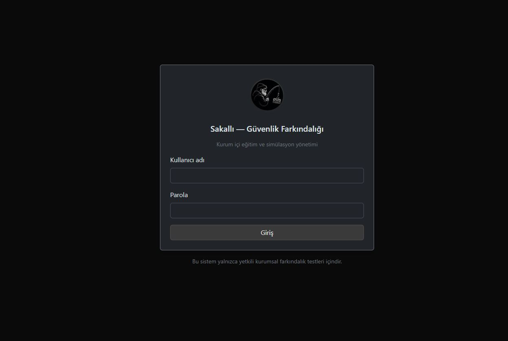
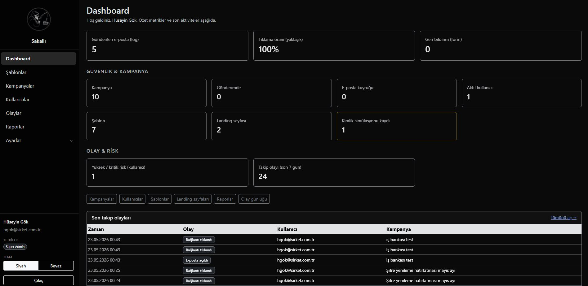
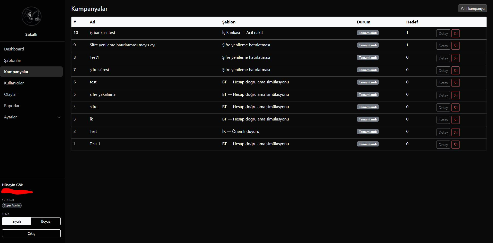
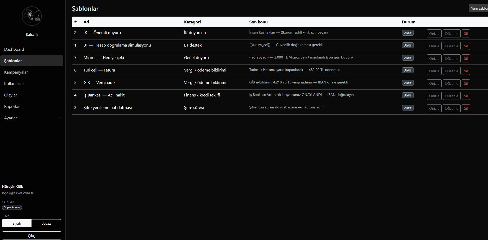
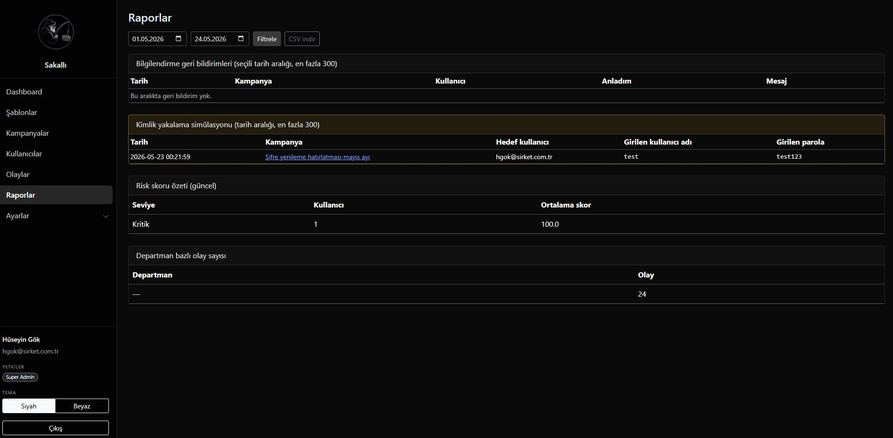

<div align="center">
  
  <h1>Sakallı</h1>
  <p><strong>Kurumsal güvenlik farkındalığı ve oltalama (phishing) simülasyonu paneli</strong></p>
  <p>PHP 8.3 · MySQL · Bootstrap 5</p>
</div>

<br>

Saf **PHP 8.3**, **MySQL**, **Bootstrap 5** ile geliştirilmiştir (Laravel yok).

> **Yasal uyarı:** Bu yazılım yalnızca yetkili güvenlik ekipleri tarafından, kurum politikası ve yazılı onay kapsamında kullanılmalıdır. İzinsiz kullanım yasalara aykırı olabilir.

## Ekran görüntüleri

| Giriş | Dashboard |
|:---:|:---:|
|  |  |

| Kampanyalar | Şablonlar |
|:---:|:---:|
|  |  |

| Raporlar |
|:---:|
|  |

## Özellikler

- LDAP / Active Directory ile panel girişi
- E-posta şablonları, kampanyalar ve hedef yönetimi
- AD organizational unit (OU) altından hedef kullanıcı çekme
- Takip linkleri (tıklama, form, kimlik bilgisi yakalama modları)
- SMTP kuyruk ve cron ile toplu gönderim
- Raporlar, olay günlüğü, risk skoru
- LDAP/SMTP ayarlarının veritabanında şifreli saklanması
- Rol tabanlı erişim: `super_admin`, `security_manager`, `report_viewer`

## Gereksinimler

| Bileşen | Sürüm |
|---------|--------|
| PHP | 8.3+ (`ext-ldap`, `ext-pdo_mysql`, `ext-openssl`, `ext-mbstring`) |
| MySQL | 8.0+ veya MariaDB 10.5+ |
| Web sunucu | Apache (mod_rewrite) veya eşdeğeri |
| İsteğe bağlı | Cron / Görev Zamanlayıcı (e-posta kuyruğu) |

## Hızlı kurulum

### 1. Depoyu klonlayın

```bash
git clone https://github.com/huseyin-gok/sakalli.git
cd sakalli
```

### 2. Ortam dosyası

```bash
copy .env.example .env
```

`.env` içinde en az şunları güncelleyin:

- `APP_URL`, `APP_BASE_PATH` — tarayıcıda eriştiğiniz tam yol
- `DB_*` — veritabanı bağlantısı
- `LDAP_*` — Active Directory (veya test için kapalı bırakıp manuel kullanıcı)
- `SMTP_*` — test posta sunucusu

**Asla** gerçek parolaları repoya commit etmeyin. Üretimde `APP_DEBUG=false` kullanın.

### 3. Veritabanı

MySQL’de veritabanı oluşturun, ardından sırayla çalıştırın:

1. `database/migrations/001_initial_schema.sql`
2. Aynı klasördeki diğer migration dosyaları — dosya adına göre artan sırada (aynı önek numarasında alfabetik sıra)
3. `database/seeders/001_roles.sql`
4. İsteğe bağlı: `database/seeders/002_example_manual_user.sql` (LDAP kapalı test kullanıcısı)

### 4. Dizin izinleri

Yazılabilir olmalı:

- `storage/logs/`
- `storage/cache/`
- `storage/secrets/` (şifreleme anahtarı otomatik üretilir)
- `storage/exports/`
- `public/images/` (logo yükleme)

### 5. Web kökü

Document root’u **`public/`** klasörüne yönlendirin.

Örnek (WAMP alt dizin):

- URL: `http://localhost/sakalli/public`
- `.env`: `APP_BASE_PATH=/sakalli/public`

### 6. E-posta kuyruğu (cron)

Periyodik çalıştırma:

```bash
php public/cron/process_queue.php
```

Windows Görev Zamanlayıcı veya Linux cron ile 1–5 dakikada bir yeterlidir. Parti boyutu: `EMAIL_QUEUE_BATCH_SIZE` (`.env`).

## İlk giriş

| Yöntem | Açıklama |
|--------|----------|
| LDAP | `LDAP_BIND_DN`, `LDAP_BASE_DN` ve panel OU kısıtını yapılandırın; kullanıcı AD ile giriş yapar |
| Manuel kullanıcı | `002_example_manual_user.sql` — örnek `demo_viewer` / `demo.viewer@example.com` (parola yok; LDAP veya sonradan atanan hash gerekir) |
| Otomatik kayıt | `LDAP_AUTO_PROVISION=true` — ilk başarılı AD girişinde yerel kayıt |

Roller `001_roles.sql` ile gelir. İlk süper yönetici için veritabanında `user_roles` tablosuna `super_admin` atayın veya LDAP + provision kullanın.

## Yapılandırma özeti

| Alan | Konum |
|------|--------|
| Genel (kurum adı, logo) | Panel → Ayarlar |
| LDAP | Ayarlar → LDAP (veya `.env` yedek) |
| SMTP | Ayarlar → SMTP |
| Şifreli paket anahtarı | `SETTINGS_ENCRYPTION_KEY` veya `storage/secrets/app_encryption.key` |

Öncelik: veritabanında kayıtlı entegrasyon ayarları → yoksa `.env`.

## Proje yapısı

```
app/           Controllers, Services, Repositories, Models
bootstrap/     Uygulama önyükleme, .env yükleme
config/        Veritabanı vb.
database/      migrations/, seeders/
screenshots/   README için arayüz görselleri
public/        index.php, cron/, statik dosyalar
resources/     views/, e-posta şablonları
routes/        web.php
storage/       log, cache, secrets, exports (git dışı)
```

## Güvenlik notları (paylaşım öncesi)

Repoya göndermeden önce:

1. `.env` dosyasının **commit edilmediğini** doğrulayın (`git status`).
2. `storage/logs/*.log` içinde DN, IP veya kullanıcı adı kalmadığından emin olun.
3. Gerçek kurum alan adları, iç IP’ler ve servis hesapları yalnızca yerel `.env` veya panel ayarlarında kalsın.
4. Daha önce sızıntı olduysa LDAP/SMTP parolalarını **yenileyin**.

## Geliştirme

- PHP 8.3 strict types, PSR-4 benzeri autoload (`App\` → `app/`)
- CSRF koruması formlarda
- Oturum: `httponly`, `SameSite=Lax`, HTTPS’te `secure`

Test iskeleti: `tests/SmokeTest.php` (PHPUnit eklenebilir).

## Lisans

Bu depo için lisans dosyası eklemediyseniz, GitHub’da paylaşmadan önce uygun bir lisans (ör. MIT, AGPL) seçmeniz önerilir.

## Katkı

Issue ve pull request’lerde kurum adı, iç ağ adresi veya kimlik bilgisi **paylaşmayın**. Yapılandırma örnekleri için `kurum.local`, `example.com` gibi yer tutucular kullanın.
